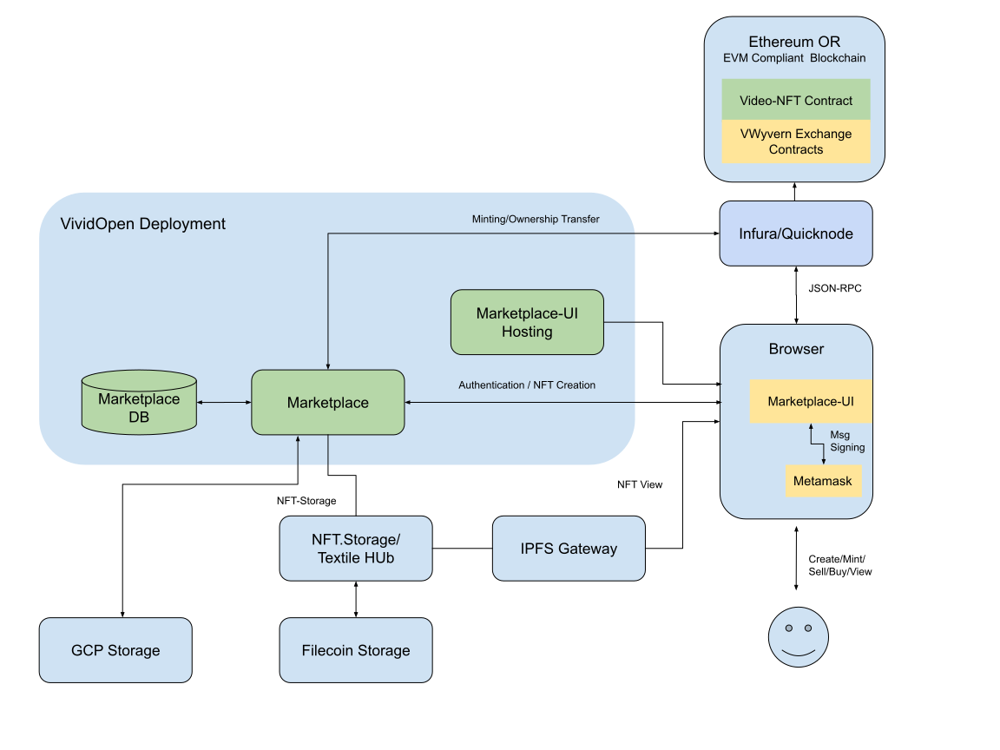

# VideoCoin NFT Installer

The repo contains installers and instructions for using VideoCoin-NFT marketplace with Filecoin storage along with an Ethereum VM compliant blockchains.  

The installer is based on docker-compose scripts that use VideoCoin-NFT marketplace backend, marketplace-UI in the form of docker containers. It also contains instructions for installing video-nft smart-contracts and wyvern-exchange smart-contracts on an Ethereum-VM compliant blockchain.

Filecoin storage can be accessed through third party Filecoin storage access providers such as nft.storage or Textile Hub.

## Prerequisites
* **Hardware**: Marketplace docker images can be used with any container orchestration platforms such as Kubernetes that allow mult-machine clusters for application scalability. We use docker-compose for testing the containers on 16-Core/32GB GCP instances.
* **Docker Engine and docker-compose**: Prepare your machine by installing Docker Engine and docker-compose: Refer https://docs.docker.com/engine/install/  and  https://docs.docker.com/compose/install/ for installation instructions.
* **Filecoin storage access**: VideoCoin NFTs are stored on Filecoin Storage Blockchain. The following storage access providers are used to access the Filecoin. These providers also pin the NFTs to be accessible  through the IPFS file system/gateways. The installer needs the API keys from one of these providers.
  * *NFT.Storage*: Refer https://nft.storage/ for subscription to the service 
  * *Textile Hub*: Refer https://www.textile.io/ for subscription to the service.
* **Blockchain**: Select a Ethereum VM complaint blockchain and install the VideoCoin-NFT and Wyvern Exchange Contracts. Following are some examples:
  * *Ethereum Mainnet*
  * *Polygon-Matic*
  * Ethereum Testnets Rinkeby, Ropsten etc. for testing
* **Blockchain Access**: VideoCoin-NFT Marketplace accesses the Blockchain through Json-RPC. Marketplace can be connected either to your own node connected to Blockchain or your can use one of the providers. Following are some providers:  
  * *Infura*: Refer https://infura.io/ for subscription to the service.
  * *Quicknode*: Refer https://www.quicknode.com/ for subscription to the service.

## Marketplace component repos and Docker Images
* Marketplace:
  * docker image: registry.videocoin.net/nft/marketplace:beta2  
  * git repo: https://github.com/videocoin/marketplace
* Marketplace-UI:
  * docker image: registry.videocoin.net/nft/marketplace-ui:beta
  * git repo: https://github.com/videocoin/nft-app-ext
* VideoCoin-NFT Contract:
  * git repo: https://github.com/videocoin/videocoin-nft
* Wyvern Exchange contract
  * git repo: https://github.com/videocoin/wyvern-ethereum
## Quick start

### Checkout the repo, get the submodules.
```
git clone https://github.com/videocoin/videocoin-nft-installer.git
git submodule update --init --recursive
```

### Install the VideoCoin-NFT and Wyvern Contracts
Follow the instructions in the repos to install the contracts on the selected blockchain. The instructions in the repos use truffle tool to deploy the contracts. Alternately you can use etg_Brownie tool to deploy the contracts. We documented the contract deployment using eth_Browinie in . Y


### Marketplace environment variables
Modify the marketplace_env.list  in the repo with deployed addresses.
The following environment variables are used to supply the following:
* Deployed contract addresses of VideoCoin NFT and Wyvern Exchange contracts
* Filecoin storage provider API keys
* Blockchain access provider API keys
* GCP Bucket and credentials for storage backup on GCP
* Connectivity to Postgres DB

marketplace_env.list:

```
ERC721_CONTRACT_ADDRESS=<VideoCoin NFT contract address>
ERC721_CONTRACT_KEY=<Contract owner address. It should be in the following form  
'{"address": "xxxxxxxxxxxx", "crypto": {"cipher": "aes-128-ctr", "cipherparams": {"iv": "xxxxxxxxxxxxxxxxx"}, "ciphertext": "xxxxxxxxxxxxxxxxxxxxxxxx", "kdf": "scrypt", "kdfparams": {"dklen": 32, "n": 262144, "r": 1, "p": 8, "salt": "xxxxxxxxxxxxxxx"}, "mac": "xxxxxxxxxxxxx"}, "id": "xxxxxxxxxxxxx", "version": 3}'>

ERC721_CONTRACT_KEY_PASS=<Password for ERC721_CONTRACT_KEY>

BLOCKCHAIN_SCAN_FROM=<block number of blockchain where contract activity started>
BLOCKCHAIN_URL=<Json-RPC End point for blockchain access>
BLOCKCHAIN_ID=<Blockchain ID>

DBURI="host=postgres port=5432 dbname=marketplace sslmode=disable"

NFTSTORAGE_API_KEY=<NFT Storage API key>
STORAGE_BACKEND=nftstorage


GCP_BUCKET=<GCP Bucket>
GOOGLE_APPLICATION_CREDENTIALS=<GCP Bucket access credentials json file path>
```
Note: GOOGLE_APPLICATION_CREDENTIALS refers to a path in the docker container. Look at the marketplace volumes attribute in docker-compose.yaml to map the credentials from the host file.


If you are using Textile Hub Filecoin storage, provide the following instead of NFTSTORAGE_API_KEY and STORAGE_BACKEND=nftstorage

```
MARKETPLACE_TEXTILE_AUTH_KEY=""
MARKETPLACE_TEXTILE_AUTH_SECRET=""
MARKETPLACE_TEXTILE_THREAD_ID=""
MARKETPLACE_TEXTILE_BUCKET_ROOT_KEY=""
STORAGE_BACKEND=textile
```

### Marketplace UI environment variables

Modify the marketplace-UI(nft-app_env.list) in the repo with deployed addresses.
The following environment variables are used to supply the following:
* installed contract addresses
* Blockchain access provider
* Marketplace Server URL

nft-app_env.list:
```
REACT_APP_TOKEN_ADDRESS=<VideoCoin NFT contract address>

REACT_APP_WYVERN_EXCHANGE=<WyvernExchange contract address>
REACT_APP_WYVERN_PROXY_REGISTRY=<WyvernProxyRegistry contract address>
REACT_APP_WYVERN_ATOMICIZER=<WyvernAtomicizer contract address>
REACT_APP_WYVERN_TOKEN_TRANSFER_PROXY=<WyvernTokenTransferProxy>
REACT_APP_NETWORKS=<Blockchain NetworkID>

REACT_APP_CUSTOM_FEE_RECIPIENT=<Protocol fee recipient address>
REACT_APP_CUSTOM_PROVIDER_URL=<Json-RPC for blockchain access>

REACT_APP_API_BASE_CUSTOM='<market place ip address>:8088'
REACT_APP_SITE_HOST_CUSTOM=
```

### Start Marketplace

You can start marketplace using the docker-compose cli
```
docker-compose up marketplace nft-app
```
## Open the browser and launch the aft-app.
```
http://<url:8080>
```

## Overview of VideoNFT Marketplace Components
* Marketplace-UI(Frontend)
* Marketplace(API Backend)
* Postgres(Database for user-info)
* Blockchain, Ethereum Mainnet or other EVM Compliant blockchains
* VideoCoin-NFT Contract
* Wyvern Exchange Contracts
* Filecoin Storage and providers




